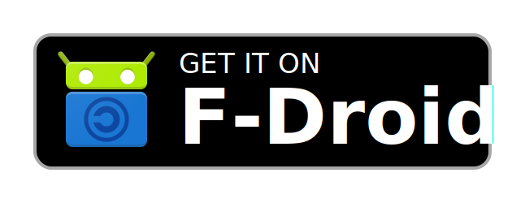
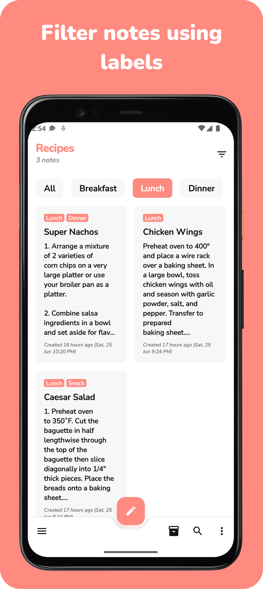
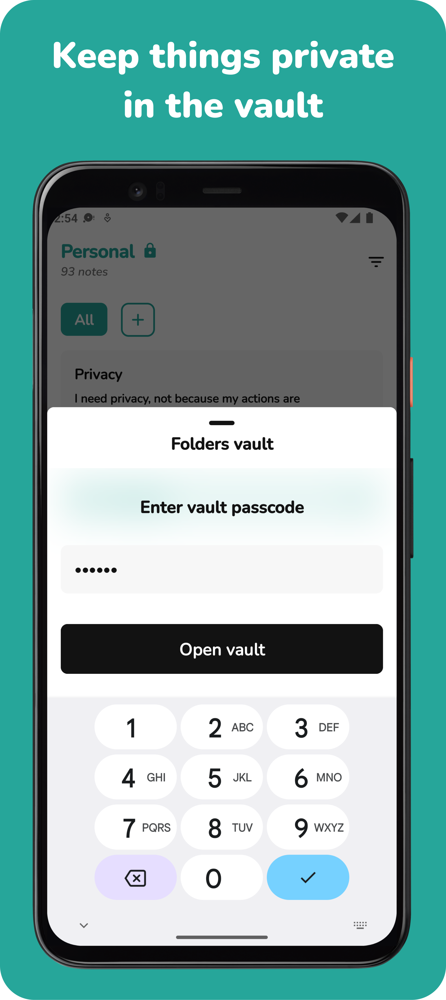
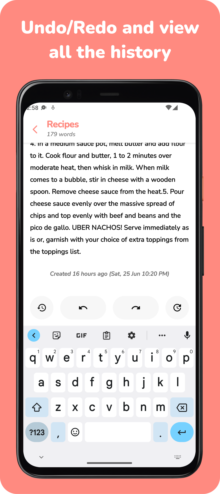
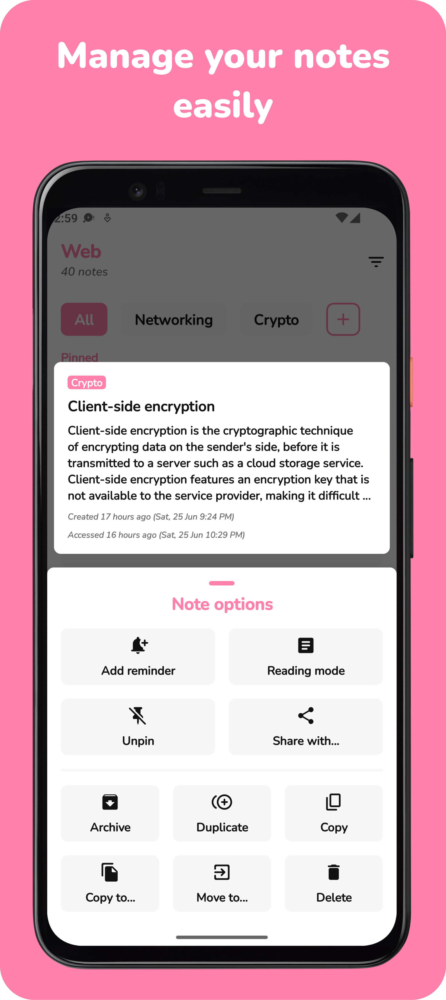
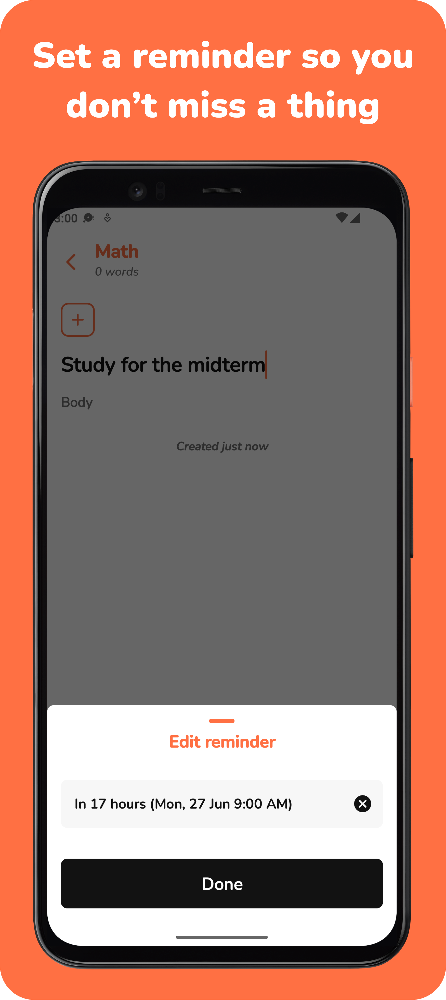
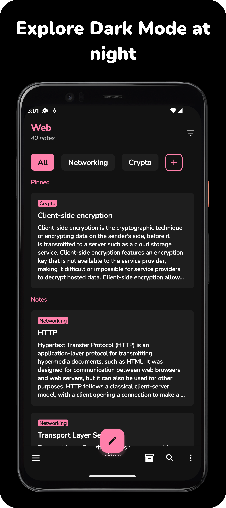
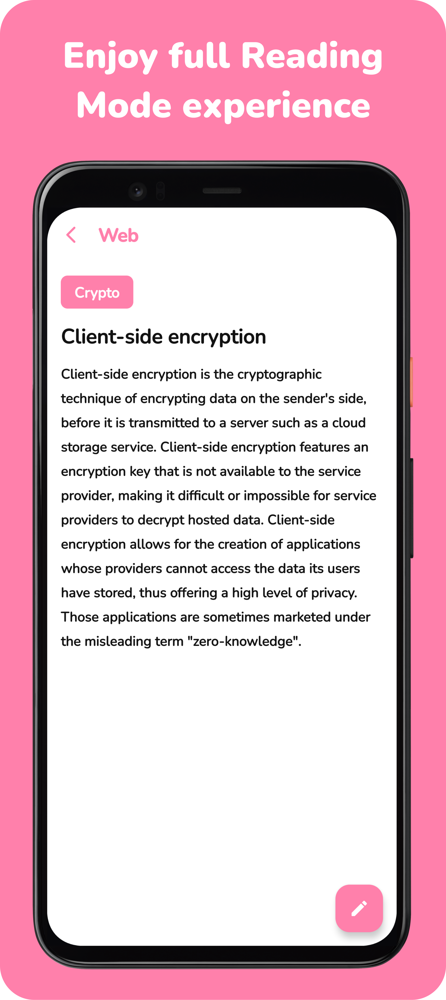

<h1 align="center">
    
     
    <b>Noto | Minimal Note-Taking App</b>
</h1>

    
    
    
    
    
    

    <a href="#download">Download</a>
    •
    <a href="#motivation">Motivation</a>
    •
    <a href="#features">Features</a>
    •
    <a href="#contributions">Contributions</a>
    •
    <a href="#translation-and-localization">Translation & Localization</a>
    •
    <a href="#architecture">Architecture</a>
    •
    <a href="#screenshots">Screenshots</a>
    •
    <a href="#support">Support</a>
    •
    <a href="#license">License</a>

## Download

    <h4><b>You can get Noto from one of the links below!</b></h4>
    
    
    

## Motivation

There are a lot of note-taking apps available out-there, but only a few that do it well. Well, Noto is one of them.

The goal of Noto is to be a minimalistic, free, and open-source note-taking application that meets the user's
expectations, with privacy in mind.

Noto is also part of my [portfolio](https://alialbaali.com) projects. It showcases my skills regarding developing
Android apps.

## Features

### General

* Ad-Free.
* Private and secure.
* Small APK size (around 5 MB).
* Minimal, modern, and simplistic design.
* Light/Dark/Black/System themes.
* Support for devices with API 21 (Lollipop) and up.
* All data is stored locally on the device.
* Language support for English, Turkish, Arabic, Indonesian, Czech, German, Italian, Spanish, and French.
* Material You (Material 3) support.
* Navigating to the top when clicking on the top app bar.

### Folders

* Colorful folders.
* Folders archive.
* Folders vault.
* Pinned folders.
* Sorting folders alphabetically, by creation date, or manually.
* Folders widget.

### Notes

* Multi sequential selection for notes.
* Option to merge selected notes.
* Notes archive.
* List and grid layouts.
* Auto save.
* Undo/Redo with history view.
* Undo/Redo swiping gestures.
* Reminders.
* Copy/Move/Duplicate note options.
* Word-count.
* Pinned notes.
* Sorting alphabetically, by access date, by creation date, or manually.
* Grouping notes by label, by access date, or by creation date.
* Notes widget.
* All notes view with search functionality.
* Recently accessed notes view with search functionality.
* Saving selected text by using Quick note option. Default folder is General, can be overridden in Settings.

### Labels

* Filtering notes using labels unique to each folder.
* Inclusive/Exclusive/Strict label filtering.

### Reading Mode

* Full-Screen mode option.
* Do Not Disturb mode option.
* Keep screen on option.
* Quick edit (Jumping to the scrolled text).
* Custom screen brightness level option.
* Paging notes support, like reading a book.
* Support for paging only selected/filtered notes.
* Option to open notes in Reading Mode by default.

### Settings

* Export/Import all app data.
* Custom app icons.
* Remembering folders and notes scrolling position.

## Contributions

  Contributions are always welcome! If you would like to contribute, please feel free to file an issue or create a PR.

#### Special thanks to everyone who has helped and contributed in the development.

## Translation and Localization

  If you would like to translate the app, please contact me via <a href="mailto:ali@albaali.com">email</a>.

#### Special thanks to:

- <a href="https://linkedin.com/in/nuraysabri/">Nuray Sabri</a>, and <a href="https://sakci.me">Alparslan Şakçi</a> for
  the Turkish localization.
- <a href="https://github.com/faus32">Faus AM</a> for the Spanish localization.
- <a href="https://github.com/kernoeb">Kernoeb</a>, and <a href="https://geoffreycrofte.com">Geoffrey Crofte</a> for the
  French localization.
- <a href="https://github.com/matteolomba">Matteo Lombardi</a>, and <a href="https://github.com/SimoneG97">SimoneG</a>
  for the Italian localization.
- <a href="https://github.com/vikdevelop">Viktor Novák</a> for the Czech localization.
- <a href="http://github.com/ErnestasKaralius">Ernestas Karalius</a> for the Lithuanian localization.
- <a href="https://steamcommunity.com/id/oliverberry">李華</a> for the Simplified Chinese localization.
- Uli N for the German localization.
- <a href="https://angellabs.xyz">Angel C.</a>

## App Icons

#### App icons use <a href="https://www.figma.com/community/file/830405806109119447/">Collection of Gradients</a> published by <a href="https://geoffreycrofte.com/">Geoffrey Crofte</a> licensed under <a href="https://creativecommons.org/licenses/by/4.0/">CC BY 4.0</a>.

## Architecture

#### The app is built with the Kotlin language.

The app uses Clean Architecture with MVVM design pattern, and it's divided into 3 main layers.

#### Domain

Contains model, repository and data sources interfaces.

#### Data

Contains database and repository and DAO implementations.

#### Presentation (the rest of the app)

Contains all the UI logic.

## Screenshots

  
Click to expand screenshots

  

    

      
      
      
      
    

    

      
      
      
      
    

  

## Community

  

## Support

<h1 align="center">
   
</h1>

## License

Noto is distributed under the terms of the Apache License (Version 2.0). See [License](LICENSE.md) for details.
